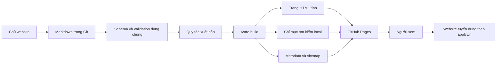

# PROJECT PLAN — Website giới thiệu việc làm

Ngày: 03/10/2026. Đây là thiết kế Phase 1 gốc. Website đã triển khai theo yêu cầu tiếp tục; xem TASK_STATUS.md và qa/REPORT.md cho trạng thái hiện tại.

## 1. Phạm vi và hiện trạng

Workspace `D:\Refers` trống tại thời điểm kiểm tra, chưa có source, package manifest hoặc Git repository. Có Node.js 24.19.0, npm 11.17.0 và Git 2.55.0.windows.3. Chưa cài dependency, chưa build, chưa deploy. Chưa có tên thương hiệu, GitHub repository hay domain thật; những thông tin này không cản trở Phase 1.

Mục tiêu: chủ website tự đăng việc bằng Markdown, người xem tìm và đọc việc rồi chuyển tới website nguồn. Website không nhận hồ sơ, không có đăng nhập, database, admin backend, CMS trả phí, scraping, API/RSS import hoặc AI tạo/cập nhật tin. Không có tác vụ tự đăng nội dung.

Ngôn ngữ giao diện và hướng dẫn: tiếng Việt. Tạm dùng tên mô tả “Việc làm chọn lọc”; chủ website có thể thay tên một lần trong cấu hình ở Phase 2.

## 2. ARCHITECTURE

Chọn Astro static output + TypeScript + Content Collections + Markdown/YAML; CSS thuần với design tokens, JavaScript nhỏ cho search/filter/theme. Không cần React hoặc server runtime cho MVP. npm và lockfile thống nhất máy local/CI. Phiên bản dependency cụ thể sẽ được kiểm tra tương thích và khóa khi bắt đầu Phase 2, không chọn theo phỏng đoán.



Astro Content Collections dùng loader đọc file local, cấu hình tại `src/content.config.ts`. Schema và chính sách nằm trong module dùng chung có thể chạy từ CLI; Agent A xác nhận cách import Zod tương thích với Astro đã khóa. Không duy trì hai schema độc lập. Theo [tài liệu Content Collections](https://docs.astro.build/en/guides/content-collections/), collection hỗ trợ schema và tạo trang từ nội dung tại build.

Hợp đồng giữa các phần:

- `JobData`: metadata đã kiểm định; `id` lấy từ tên file, `body` là Markdown do chủ website viết.
- `getPublicationState(job, today)`: một nơi quyết định hidden/active/expired; ngày hôm nay dùng `Asia/Ho_Chi_Minh` (UTC+7), có thể truyền ngày cố định khi test.
- `getPublicJobs()` và `getActiveJobs()`: danh sách dùng chung cho route, homepage, facets, search và sitemap; không lọc riêng rải rác trong component.
- `toSearchRecord()`: chỉ xuất metadata cần tìm kiếm, mô tả dạng plain text, URL nội bộ và ngày hết hạn; không đưa draft/archived/sample vào payload production.
- `withBase(path)` và bộ tạo canonical dùng cùng cấu hình `site/base`.
- Giao diện nhận dữ liệu đã chuẩn hóa; không tự đọc file, đoán mức lương hay sửa outbound URL.

## 3. CONTENT MANAGEMENT PLAN

Mỗi việc làm là một file `src/content/jobs/ten-viec-cong-ty.md`. Tên file dùng chữ thường ASCII, số và dấu gạch ngang; không thư mục con, không field slug thứ hai. Đổi tên file sẽ đổi URL; README phải nhắc tránh đổi tên tin đã chia sẻ nếu không cần thiết.

Template dự kiến dưới đây là đặc tả, chưa phải nội dung tuyển dụng hay file template đã triển khai:

```yaml
---
title: ""
company: ""
location: ""
workType: "Remote"
employmentType: "Full-time"
salaryMin: null
salaryMax: null
currency: null
salaryPeriod: null
category: ""
sourceName: ""
sourceUrl: ""
applyUrl: ""
publishedDate: "YYYY-MM-DD"
expirationDate: null
tags: []
featured: false
sponsored: false
draft: true
status: "active"
sample: false
---
```

Phần dưới frontmatter chứa mô tả thật, các mục yêu cầu, quyền lợi và thông tin khác do chủ website nhập. Hỗ trợ headings, đoạn văn, danh sách, chữ đậm, liên kết Markdown. Không thêm trường description bắt buộc thứ hai: mô tả chính nằm ở body, excerpt/SEO lấy plain text từ body; tùy chọn `summary` cho người muốn tự viết tóm tắt.

### Quy tắc schema

- Bắt buộc chuỗi không rỗng: title, company, location, employmentType, category, sourceName, sourceUrl, applyUrl, publishedDate. Body phải có nội dung thực, không chỉ whitespace/comment.
- `workType`: chỉ Remote, Hybrid, On-site; không thay bằng field remote boolean.
- `employmentType`: chuỗi không rỗng, gợi ý Full-time, Part-time, Contract, Internship, Freelance; không cần sửa code khi thêm loại hợp lệ khác.
- Ngày: chuỗi có dấu nháy, đúng YYYY-MM-DD và ngày lịch thực. expirationDate tùy chọn, không trước publishedDate. publishedDate tương lai chỉ cho phép trong draft; không hứa tự hẹn giờ đăng bài.
- salaryMin/salaryMax: số hữu hạn không âm, có thể bỏ trống/null; nếu có cả hai thì min <= max. Nếu có lương, bắt buộc currency theo mã tiền tệ được hỗ trợ và salaryPeriod thuộc hour/day/month/year/project. Không có lương thì ẩn khối lương, không tự tạo số hoặc tự suy ra “thỏa thuận”.
- featured, sponsored, draft, sample: boolean thật, không chấp nhận chuỗi "false". `draft` bắt buộc để tránh vô tình xuất bản; các flag còn lại mặc định false.
- status: active (mặc định), expired, archived. tags là danh sách chuỗi không rỗng; summary nếu có phải là chuỗi không rỗng.
- URL phải tuyệt đối HTTP(S), có hostname, không credentials, không javascript/data/file. Giữ nguyên link được nhập; không rút gọn, thêm tracking hoặc tự thay link. Không kiểm tra mạng trong build.
- Các trường tùy chọn rỗng/null được chuẩn hóa nhất quán. Metadata không được nhận diện là lỗi để bắt lỗi gõ nhầm. Trường bắt buộc rỗng vẫn lỗi kể cả draft; template trắng nằm ngoài collection nên chủ website có thể điền dần trước khi validate.
- Trùng slug hoặc tên file khác nhau chỉ ở hoa/thường: lỗi chặn build. Trùng applyUrl hoặc title+company+location: cảnh báo vì có thể là các vị trí hợp lệ chung trang nguồn.
- Markdown chỉ hỗ trợ nội dung, không MDX hoặc JavaScript; chặn raw HTML chủ động và URL nguy hiểm bằng pipeline thống nhất. Không dựa vào Markdown để thực thi script.

`npm run validate-jobs` gom lỗi theo `file → field → lý do`, exit khác 0 khi có lỗi. Ví dụ: `src/content/jobs/vi-du.md → applyUrl → cần URL HTTP(S) tuyệt đối`. `npm run build` cũng bắt buộc chạy validation, không có đường tắt deploy nội dung lỗi. Kiểm tra cả draft/archived; không đưa fixture cố ý lỗi vào collection thật.

### Quy tắc công khai và hết hạn

Thứ tự: draft hoặc archived hoặc sample trong production → hidden; còn lại status expired hoặc expirationDate < hôm nay → expired; còn lại → active. Ngày hết hạn vẫn còn hiệu lực đến hết ngày UTC+7. Không có expirationDate thì không tự suy đoán.

- Hidden: không tạo detail route, card, facet, search record hoặc sitemap entry. Xóa file có tác dụng tương tự sau build/deploy thành công.
- Active: có trang chi tiết, được đưa vào listing/search/facets, có thể featured và remote, nằm trong sitemap.
- Expired: giữ trang chi tiết để liên kết cũ còn có ngữ cảnh, nhãn “Đã hết hạn”, noindex, bỏ khỏi danh sách active/search/sitemap; không có nút ứng tuyển. Liên kết nguồn vẫn hiện để đối chiếu. Không xóa file.
- sponsored nếu true phải ghi rõ “Được tài trợ”; không tự suy diễn tài trợ từ featured.
- Categories, locations, companies và tags lấy từ các tin active; không yêu cầu chỉnh navigation hay danh sách enum category.

Site tĩnh cập nhật HTML và sitemap tại thời điểm build. Không tạo cron. JavaScript dùng cùng quy tắc ngày để ẩn card vừa hết hạn và vô hiệu CTA khi người xem mở trang; khi tab đang mở, kiểm tra lại lúc quay về tab/đến ngày mới. Đây chỉ là tăng cường giao diện: trình đọc không JavaScript và crawler vẫn thấy snapshot lần build gần nhất. README phải nêu giới hạn này và cách owner chạy lại workflow thủ công. Quy tắc này không xác nhận nhà tuyển dụng còn tuyển.

### Dữ liệu mẫu

8 mẫu hợp lệ nằm tại `tests/fixtures/jobs/valid/`, ghi rõ SAMPLE / DEVELOPMENT DATA và `sample: true`, chỉ dùng tên tổ chức minh họa và example.com. Mẫu lỗi nằm riêng `tests/fixtures/jobs/invalid/`. Local preview mẫu dùng lệnh riêng `npm run dev:samples` và banner rõ ràng. Production không cho bật chế độ mẫu; build bình thường với collection rỗng vẫn thành công và hiển thị trạng thái chưa có việc. Không có real job do agent tự tìm hoặc tạo.

## 4. Website và trải nghiệm

- `/`: hero gọn, tìm việc ngay, Featured Jobs, Latest Jobs, Popular Categories theo số tin active, Remote Jobs. Khi không có dữ liệu thật, hiện trạng thái trống trung thực; không bịa số việc hoặc nhà tuyển dụng.
- `/jobs/`: tìm trong title/company/location/category/tags/body plain text; không phân biệt hoa thường và dấu tiếng Việt (gồm đ/Đ). AND giữa các filter, các token từ khóa đều cần khớp. Category, location, workType, company; ngày đăng tất cả/24 giờ không dùng vì chỉ lưu ngày, thay bằng hôm nay/7 ngày/30 ngày theo ngày lịch gồm hôm nay. Sort mới nhất mặc định, cũ nhất, tiêu đề A–Z; tie-break theo id.
- Search/filter/sort lưu vào query string, giữ khi reload/back/forward. Có số kết quả, xóa tất cả, thông báo rỗng. Mốc 7 ngày là hôm nay trừ 6 ngày. Homepage search/category/remote dẫn tới `/jobs/` với query tương ứng.
- `/jobs/[id]/`: title, company, location, workType, employmentType, salary nếu có, Markdown, tags, publishedDate, sourceName/sourceUrl và hostname ứng tuyển. CTA “Xem việc & Ứng tuyển” lấy chính xác applyUrl. Nếu mở tab mới thì báo rõ và dùng noopener noreferrer; sponsored thêm rel sponsored.
- `/about/`: giới thiệu nội dung được chủ website chọn và đăng thủ công; ứng tuyển tại nguồn.
- `/disclaimer/`: tin có thể thay đổi, cần kiểm tra nguồn, không đảm bảo còn tuyển, website không yêu cầu thanh toán để ứng tuyển.
- `/404.html`: trang không tìm thấy và đường quay về jobs có base đúng.

Thẻ việc dùng chữ viết tắt công ty khi không có logo; không tự lấy logo qua mạng. CSS tokens cho light/dark/system, lưu lựa chọn local; system tiếp tục theo OS khi OS đổi. Storage bị chặn vẫn dùng được.

Progressive enhancement: không JavaScript vẫn đọc được danh sách HTML và trang chi tiết, mở nguồn; search/filter/theme selector là chức năng cần JavaScript, có thông báo noscript. Không hứa category query lọc được khi tắt JavaScript.

SEO: title/description riêng từng trang; canonical, Open Graph, sitemap, robots; semantic HTML và lang vi. Không JobPosting structured data. Preview sample noindex; production không rò nội dung ẩn. Chưa có domain thật thì build local dùng cấu hình test được ghi rõ; workflow deploy phải có origin/base đúng, không xuất canonical example.com lên website thật.

## 5. DIRECTORY STRUCTURE dự kiến

```text
/
  MASTER_PLAN.md
  TASKS.md
  DECISIONS.md
  TASK_STATUS.md
  README.md
  package.json / package-lock.json
  astro.config.mjs / tsconfig.json
  .github/workflows/pages.yml
  templates/job-template.md
  scripts/validate-jobs.ts
  src/
    content.config.ts
    content/jobs/*.md
    lib/content/          # schema, policy, validation, search projection
    lib/urls.ts           # site/base helpers
    components/ui/        # header, footer, theme
    components/jobs/      # card, filters, detail view
    components/seo/       # metadata
    layouts/BaseLayout.astro
    pages/
      index.astro
      jobs/index.astro
      jobs/[id].astro
      about.astro
      disclaimer.astro
      404.astro
      robots.txt.ts
      search-index.json.ts
    scripts/              # browser search/filter/theme
    styles/
  public/favicon.svg
  tests/
    content/
    e2e/
    fixtures/jobs/valid/
    fixtures/jobs/invalid/
  qa/                     # evidence; không deploy
  dist/                   # sinh tự động, không sửa tay
```

Chỉ bốn tài liệu quản lý ở đầu cây được tạo trong Phase 1. Các file khác là kế hoạch Phase 2.

## 6. MANUAL PUBLISHING WORKFLOW

Thiết lập một lần ở Phase 2/triển khai: cài dependency, kết nối repo GitHub khi chủ website sẵn sàng, chọn nhánh publish và Pages → GitHub Actions, cấu hình URL thật. Không yêu cầu kết nối GitHub trong Phase 1.

Sau khi website đã triển khai, mỗi lần đăng việc:

1. Copy `templates/job-template.md` vào `src/content/jobs/`.
2. Đổi tên thành slug duy nhất, ví dụ `ten-viec-ten-cong-ty.md`.
3. Điền title, company, location, workType, employmentType, category.
4. Viết mô tả Markdown dưới dấu `---` thứ hai, hoàn toàn do owner quyết định.
5. Điền sourceName, sourceUrl, applyUrl bằng nguồn/liên kết mình chọn.
6. Điền publishedDate; lương/ngày hết hạn có thể để trống. Thêm tags nếu muốn.
7. Giữ draft true khi chuẩn bị; chỉ đổi false khi sẵn sàng. Tin thật để sample false.
8. Lưu, chạy `npm run validate-jobs` nếu muốn; CI luôn kiểm tra lại.
9. Chạy `npm run dev` để xem local nếu muốn, hoặc `npm run build` rồi `npm run preview` để kiểm tra bản build.
10. `git add src/content/jobs/ten-viec-ten-cong-ty.md`, `git commit -m "Them tin tuyen dung"`, `git push`.
11. Xem GitHub Actions. Chỉ deploy sau validation/build thành công; lỗi không thay bản đang hoạt động. Sửa đúng file/field được báo rồi commit/push lại.
12. Mở URL mới để đối chiếu mô tả và đích ứng tuyển.

Sửa việc hoặc link: chỉ sửa file Markdown, commit/push. Gỡ tạm: draft true. Lưu trữ: status archived. Gỡ hẳn: xóa file. Đánh dấu hết hạn ngay: status expired. Nổi bật: featured true. Khôi phục expired: status active và sửa/bỏ ngày hết hạn theo thông tin owner xác nhận. Không cần sửa component hay TypeScript.

README Phase 2 bắt buộc có chính xác các mục: How to add a new job; How to edit a job; How to change an application link; How to remove a job; How to mark a job expired; How to make a job draft; How to feature a job; How to run locally; How to validate jobs; How to build; How to deploy. Nội dung hướng dẫn bằng tiếng Việt, kèm chú thích từng field/template và cách xử lý lỗi YAML.

Các lệnh trên chưa tồn tại trong Phase 1; đây là giao diện lệnh phải triển khai và kiểm thử.

## 7. GitHub Pages workflow

Push nhánh publish (mặc định dự kiến main) và workflow_dispatch kích hoạt build/deploy. Pull request chỉ kiểm tra, không deploy. Không schedule, không gọi nguồn việc, không agent trong publishing workflow.

Chuỗi CI: checkout → Node phiên bản đã khóa → npm ci → validation + type check + tests → production build → kiểm tra dist → upload Pages artifact → deploy. Build command gọi validation để bảo vệ cả khi chạy local. Các action/version được xác minh và pin khi triển khai.

Build job quyền contents read; deploy job phụ thuộc build, dùng pages write/id-token write và environment github-pages, có concurrency để tránh deploy chồng. Không đặt token bí mật trong source. Thiết kế dựa trên [GitHub Pages custom workflows](https://docs.github.com/en/pages/getting-started-with-github-pages/using-custom-workflows-with-github-pages).

Hỗ trợ hai cấu hình `/` và `/ten-repo/`; lấy site/base từ cấu hình Pages và tùy chọn domain của owner, không đoán tên tài khoản. Links, assets, favicon, search-index và canonical cùng dùng helper. Theo [Astro GitHub Pages guide](https://docs.astro.build/en/guides/deploy/github/), project site cần base tương ứng repository. Cần ghi rõ robots.txt trong subpath không thay thế robots.txt cấp domain; sitemap vẫn được xuất đúng base.

## 8. Thực hiện tiếp và tiêu chí hoàn thành

Phase 2: chốt schema/contracts → các agent triển khai theo ownership tại TASKS.md. Phase 3: tích hợp và QA. Phase 4: kiểm thử owner workflow bằng các lần build thật. Không tự chuyển sang triển khai trong lượt Phase 1 này theo yêu cầu người dùng.

Website chỉ được ghi hoàn thành khi production build passes VÀ mọi tiêu chí chức năng/QA trong TASKS.md đạt. “Sẵn sàng deploy” khác “đã deploy”: nếu chưa có GitHub, bàn giao cấu hình đầy đủ và bằng chứng local, không tuyên bố website online.
