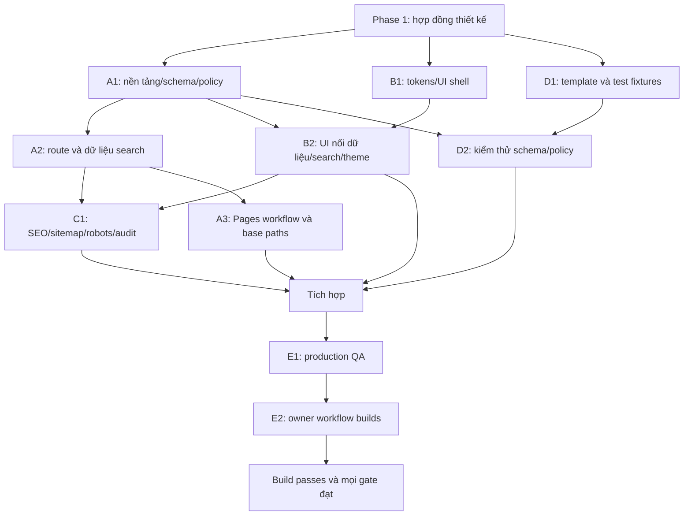

# TASKS — Phân công và nghiệm thu

Các mục dưới đây là hợp đồng task/acceptance từ Phase 1. Implementation đã thực hiện; xem TASK_STATUS.md và qa/REPORT.md cho người thực hiện thực tế, kết quả và giới hạn kiểm thử.

## SUBAGENT PLAN

- **Orchestrator — agent chính:** giữ MASTER_PLAN/DECISIONS/TASKS/TASK_STATUS và README, chốt hợp đồng, kiểm tra output, điều phối thay đổi ngoài ownership, tổng hợp bằng chứng. Không tự làm toàn bộ website.
- **Agent A — Lead Developer:** GPT-6.1 Sol, high. Sở hữu package/lockfile, Astro/TS config, src/content.config.ts, src/lib/, scripts/validate-jobs.ts, src/pages/ trừ endpoints của C, workflow Pages. Dựng core/routes dưới dạng shell; B cung cấp UI component để A ghép.
- **Agent B — Frontend:** GPT-6 Sol, medium. Sở hữu src/components/ui/, src/components/jobs/, src/layouts/, src/styles/, src/scripts/, public/favicon.svg. Homepage/listing/detail view thông qua component; không sửa schema hoặc page shell do A giữ.
- **Agent C — SEO/accessibility/performance:** GPT-6 Sol, medium. Sở hữu src/components/seo/, src/pages/robots.txt.ts và cấu hình sitemap module riêng. Đề nghị A nối sitemap vào Astro config. Audit UI, đề nghị B sửa thay vì hai agent sửa cùng file.
- **Agent D — Content tester:** GPT-6 Luna, high. Sở hữu templates/job-template.md, tests/fixtures/, tests/content/. Soạn 8 sample hợp lệ và các negative cases riêng; không tạo việc thật. Hỗ trợ owner rà hướng dẫn README.
- **Agent E — QA/integration:** GPT-6.1 Sol, high. Sở hữu tests/e2e/, qa/. Chạy production build, kiểm tra artifact/routes/browser, owner workflow; chuyển lỗi core/UI về đúng owner, kiểm tra lại bản tích hợp. Orchestrator quyết định đóng task.

Giới hạn phiên hiện tại: 4 agent đồng thời tính cả orchestrator, tức tối đa 3 subagent. Không giả vờ A–E đều chạy cùng lúc. Phase 1 đã dùng đợt A/B/D, sau đó C/E khi có slot. Phase 2 lập lịch theo readiness bên dưới.

## Dependency graph

Đợt 1: A1 + B1 + D1. Đợt 2: A2/A3 + B2 + D2. Đợt 3: C1 + E chuẩn bị QA + orchestrator README; core/UI sửa lỗi khi được phân lại slot. E1/E2 chỉ kết luận sau khi dependency hoàn tất. E1 phát hiện lỗi → task quay về A/B/C/D → E kiểm tra lại đúng phần bị ảnh hưởng.

## Task outputs và acceptance

### A — Core

- A1: khóa dependency, schema/policy/validator; lỗi gom theo file/field, chuẩn ngày/lương/URL/slug; CLI và build không lệch nhau.
- A2: toàn bộ routes tạo từ nội dung; homepage/facets/search dùng public active data; empty collection build được. Hidden không tạo URL hoặc payload.
- A3: build root và subpath; Actions chỉ deploy nếu build/check pass. Không backend hoặc job import; không scheduled workflow.

### B — UI

- Home đủ hero/search/featured/latest/categories/remote; có empty state thật.
- Listing search title/company/location/category/tags/description, filter category/location/workType/company/date, sort, reset, query navigation và kết quả rỗng.
- Detail thể hiện đủ metadata, Markdown, nguồn và hostname outbound; CTA lấy applyUrl. Không hard-code việc, mô tả hay URL trong component.
- Light/dark/system, storage fallback, keyboard focus, labels, live result count; responsive tối thiểu 320/360/390/768/1440px.

### C — SEO/a11y/performance

- Title/description/canonical/OG đúng từng trang; sitemap/robots đúng site/base; noindex expired/sample preview; không JobPosting schema.
- Keyboard hoàn chỉnh, heading/landmark đúng, tương phản WCAG AA; target chạm đủ lớn, không tràn ngang, hỗ trợ reduced motion nếu có animation.
- Giới hạn JS cần thiết; không font/logo/API bên thứ ba bắt buộc. Kiểm tra payload không chứa tin ẩn. Outbound target/rel/host rõ.

### D — Nội dung

- 8 sample hợp lệ: active Remote featured; Hybrid; On-site; không lương; có range lương và Markdown; draft; expired; archived. Tất cả sample true, nhãn SAMPLE / DEVELOPMENT DATA.
- Fixtures riêng cho thiếu từng field bắt buộc, YAML lỗi, workType sai, boolean dạng chuỗi, ngày sai/không tồn tại, expiration trước publication, URL nguy hiểm/credentials, số lương âm/NaN/min>max/thiếu period hoặc currency, field gõ sai, body trống.
- Trùng slug/case collision chặn build; trùng applyUrl cảnh báo. Kiểm tra ranh giới ngày trước/đúng/sau hạn với clock cố định, không expiration, precedence draft/archive/sample.
- Test template và schema đồng bộ; không đổi source khi thêm category/company/location/tags.

### E — Integration và browser QA

- Build production thành công với dữ liệu thật rỗng và tập nội dung kiểm thử trong workspace tạm cách ly. Không copy sample thành tin thật trong repo.
- Quét dist: hidden không tồn tại trong HTML, JSON/search, sitemap; expired chỉ có detail với nhãn/noindex và không CTA. Kiểm tra HTML Markdown headings/lists/bold/links.
- Chạy server preview artifact, kiểm tra home/jobs/detail/about/disclaimer/404, tải trực tiếp và reload URL con. Cả `/` và `/ten-repo/`: asset/search index/internal links/canonical hoạt động.
- Browser QA thực trên desktop và viewport mobile 360×800, 390×844, tablet 768px; thêm 320px chống overflow. Ghi trình duyệt, viewport, kết quả, screenshot. Đây là mô phỏng viewport trong trình duyệt, không tự nhận đã test điện thoại vật lý.
- Kiểm tra từ khóa có/không dấu, chữ hoa, body match, nhiều filter kết hợp, date range boundaries, sort, reset, empty results, query reload/back/forward.
- Light/dark/system qua chuyển route/reload, đổi prefers-color-scheme, localStorage bị chặn. Kiểm tra keyboard và no-JS fallback.
- External link test xác nhận chính xác href/host/rel và điều hướng tới URL fixture kiểm soát; không tuyên bố nhà tuyển dụng thật còn nhận hồ sơ hoặc kiểm tra mạng nguồn thực nếu chưa làm.

## PHASE 4 — Owner workflow bắt buộc

Chạy trong bản sao tạm/test harness, không sửa component/schema để qua test; log từng build và kiểm tra output tương ứng. Fixture ghi rõ SAMPLE DEVELOPMENT DATA; chỉ harness cách ly mô phỏng public record, không phát hành lên production.

1. Copy nguyên template; đổi tên file.
2. Điền mọi metadata bắt buộc, title/company/description/applyUrl/sourceUrl, publication date; bỏ trạng thái draft khi sẵn sàng.
3. Build 1: kiểm tra card, detail, search, category mới và href ứng tuyển xuất hiện đúng.
4. Chỉ sửa applyUrl trong Markdown.
5. Build 2: href mới xuất hiện, href cũ không còn trong artifact cho tin này.
6. Chỉ đặt draft true.
7. Build 3: không có route, card, search record, sitemap entry cho tin.
8. Khôi phục draft false, status active và thời hạn còn hiệu lực.
9. Build 4: tin xuất hiện lại.
10. Đặt status expired rồi build 5: giữ detail noindex, bỏ listing/search/sitemap và CTA.
11. Thử expirationDate trong quá khứ với status active; build 6 có cùng expired behavior; thử đúng ngày và không có ngày bằng clock cố định.
12. Thử archived và xóa file, build tương ứng xác nhận gỡ sạch; không file nguồn nào bị tự xóa bởi ứng dụng.
13. Xác nhận không thay source; dọn workspace thử nghiệm, chạy final production build với cấu hình mặc định sample-excluded.

## Bằng chứng bàn giao

QA report phải ghi command/exit code, cấu hình root/subpath, count tin public, đường dẫn artifact/screenshot và các bước owner workflow. Mỗi tiêu chí ghi PASS/FAIL/NOT RUN, không dùng “done” cho task chưa test. Chỉ đóng implementation khi tất cả gate bắt buộc PASS và production build cuối cùng thành công. GitHub chưa kết nối thì deploy live là NOT RUN, tách khỏi xác nhận sẵn sàng deploy.
